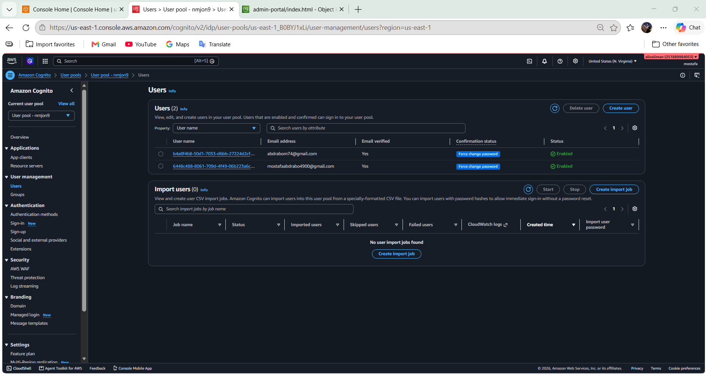
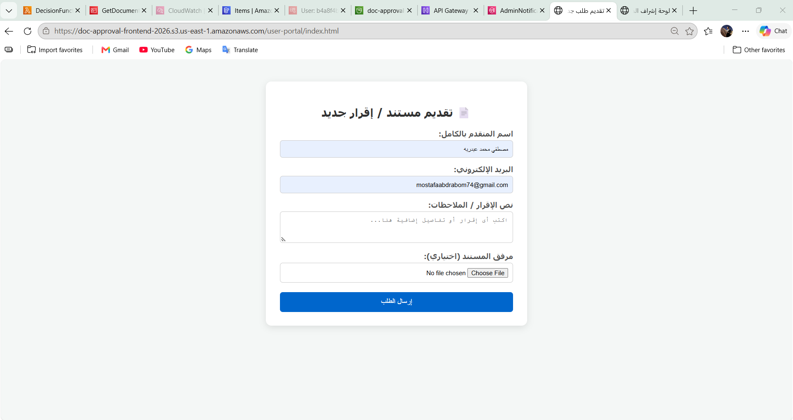
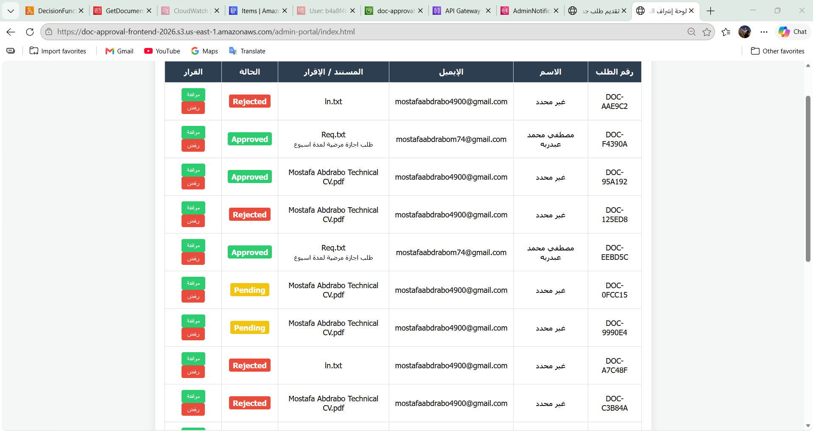
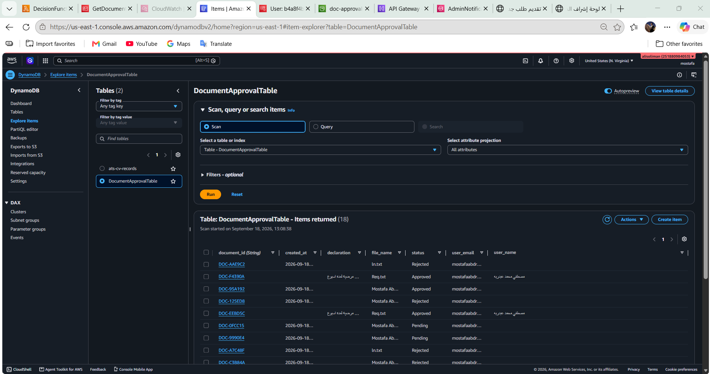
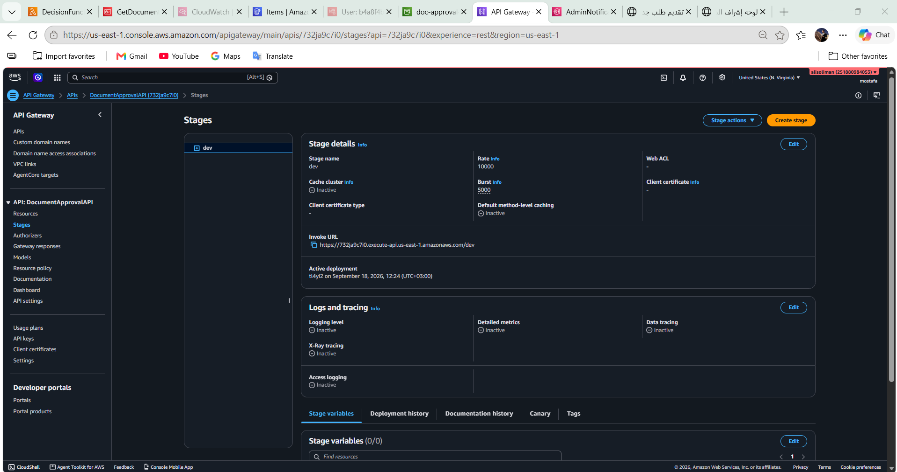
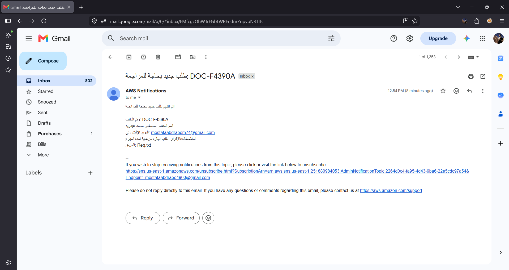

# 📝 AWS Document Approval System


AWS Document Approval System is a cloud-native, fully serverless application that manages document submission and approval workflows. It uses Amazon Cognito for role-based authentication (Users & Admins), S3 for hosting two separate portals, Lambda and API Gateway for backend logic, DynamoDB for tracking approval status, and SNS & SES for real-time notifications.

---

## 📑 Table of Contents
- [Overview](#-overview)
- [Features](#-features)
- [Architecture](#-architecture)
- [AWS Services Used](#aws-services-used)
- [Project Structure](#-project-structure)
- [Screenshots](#-screenshots)
- [Author](#-author)

---

## 🎯 Overview

This project provides a production-ready, serverless document approval workflow built entirely on AWS. Regular users submit documents or declarations through a dedicated portal; admins review, approve, or reject each submission from a separate dashboard. Every action triggers real-time notifications — admins get notified via SNS when a new document arrives, and users receive an email via SES once a decision is made.

---

## 🚀 Features

- ✅ **Role-Based Access Control:** Amazon Cognito manages two distinct user groups — Users and Admins — each with a dedicated portal.
- ✅ **Document Submission Portal:** Simple form for submitting declarations/documents with optional file attachments.
- ✅ **Admin Review Dashboard:** Centralized table view of all requests with Approve/Reject actions and live status tracking.
- ✅ **Real-Time Admin Alerts:** Amazon SNS instantly notifies the admin by email when a new document is submitted.
- ✅ **Automated Decision Emails:** Amazon SES sends the submitter a formal email once their request is approved or rejected.
- ✅ **NoSQL Persistence:** DynamoDB tracks every submission's status (Pending / Approved / Rejected) in real time.
- ✅ **100% Serverless & Cost-Optimized:** Built entirely on AWS Free Tier services with zero infrastructure maintenance.

---

## 📐 Architecture


**Flow:**
1. Users and Admins authenticate through **Amazon Cognito**, which manages two groups — `Users` and `Admins`.
2. Both roles access their dedicated portal (`user-portal` / `admin-portal`), hosted on **Amazon S3**.
3. A user submits a document through the **User Portal**, hitting **API Gateway**, which invokes the **Upload Handler Lambda**.
4. The Upload Handler saves the record to **DynamoDB** (`status = Pending`) and publishes a message to **Amazon SNS**, instantly notifying the admin by email.
5. The Admin opens the **Admin Portal**, which calls `GET /documents` on API Gateway, invoking the **Get Documents Lambda** to fetch all records from DynamoDB.
6. The Admin clicks Approve or Reject, triggering `POST /decision`, which invokes the **Decision Handler Lambda**.
7. The Decision Handler updates the record's status in **DynamoDB** and sends a formal decision email to the submitter via **Amazon SES**.

---

## 🛠 AWS Services Used

| Service | Role | Free Tier Limit |
| :--- | :--- | :--- |
| **Amazon Cognito** | User authentication & role-based access (Users/Admins groups) | 50,000 MAU |
| **Amazon S3** | Hosts both the User and Admin portals & stores uploaded documents | 5GB storage |
| **Amazon API Gateway** | REST endpoints (`/documents`, `/decision`) | 1M requests/month |
| **AWS Lambda** | Upload handler, Get Documents handler & Decision handler logic | 1M requests/month |
| **Amazon DynamoDB** | Stores document metadata and approval status | 25GB storage |
| **Amazon SNS** | Real-time email alert to the admin on new submissions | 1,000 emails/month |
| **Amazon SES** | Sends the final decision email to the submitter | 62,000 emails/month |
| **Amazon CloudWatch** | Execution logs & monitoring | 5GB logs |

---

## 📁 Project Structure

```text
aws-document-approval-system/
├── user-portal/
│   ├── index.html        # Document submission form
│   ├── script.js         # API integration
│   └── style.css         # UI styling
├── admin-portal/
│   ├── index.html        # Admin review dashboard
│   ├── script.js         # API integration & decision actions
│   └── style.css         # UI styling
├── lambda/
│   ├── upload_handler.py     # Handles new document submissions
│   ├── get_documents.py      # Fetches records for the admin dashboard
│   └── decision_handler.py   # Handles approve/reject decisions
├── screenshots/           # Architecture diagram & application proofs
│   ├── architecture.png
│   ├── cognito.png
│   ├── user_ui.png
│   ├── admin_dashboard.png
│   ├── dynamodb.png
│   ├── api.png
│   └── AWS_Notifications.png
├── .gitignore
└── README.md
```

---

## 📸 Screenshots

### 1. Amazon Cognito User Pool

*Registered users in the Cognito User Pool, ready for role-based sign-in.*

### 2. User Portal

*Submission form where users declare/upload documents for review.*

### 3. Admin Dashboard

*Centralized dashboard showing all requests with real-time status and Approve/Reject actions.*

### 4. DynamoDB Records

*All submissions tracked with status, submitter info, and timestamps in DynamoDB.*

### 5. API Gateway

*REST API stage configuration for the documents and decision endpoints.*

### 6. SNS Email Notification

*Real-time email alert sent to the admin the moment a new document is submitted.*

---

## 👤 Author

**Mostafa Mohamed Abdrabo**

[](https://www.linkedin.com/in/mostafa-m-abdrabo/)
[](https://github.com/mostafaabdrabo2022)
[](mailto:mostafaabdrabo4900@gmail.com)

---
